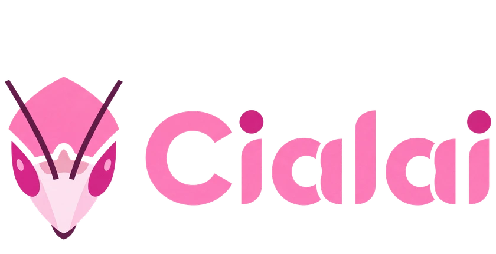
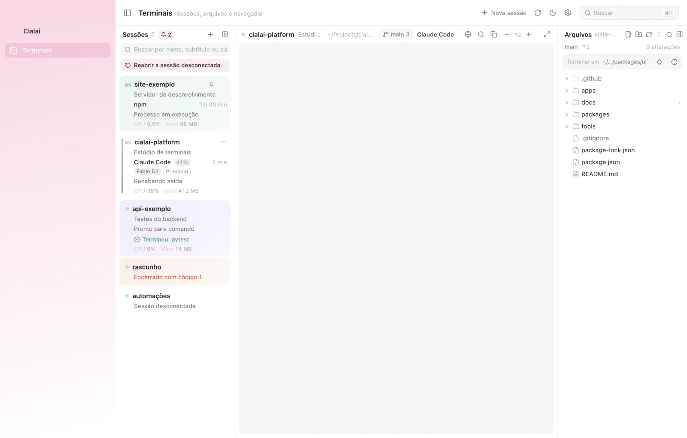
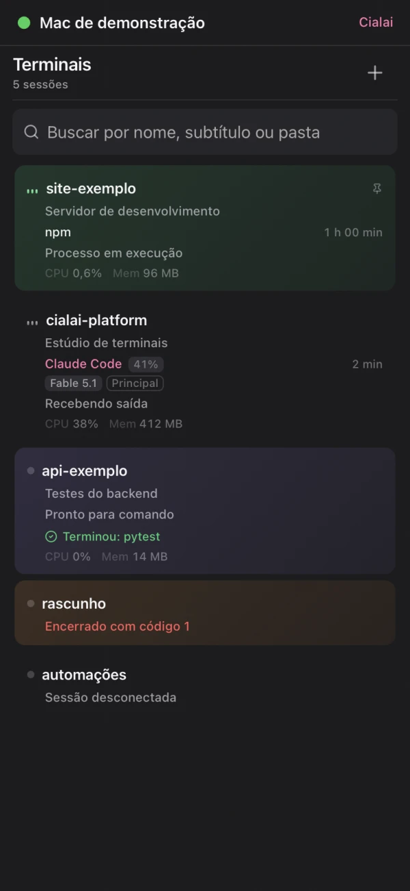
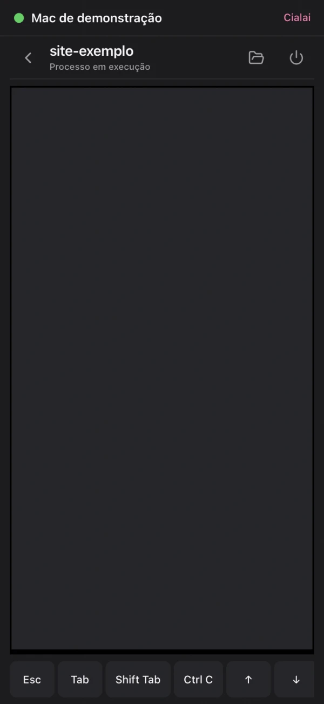
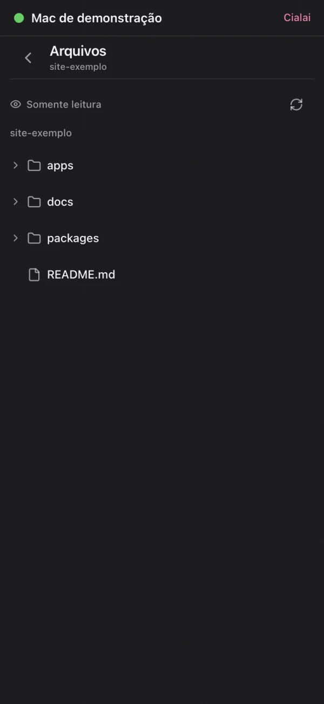
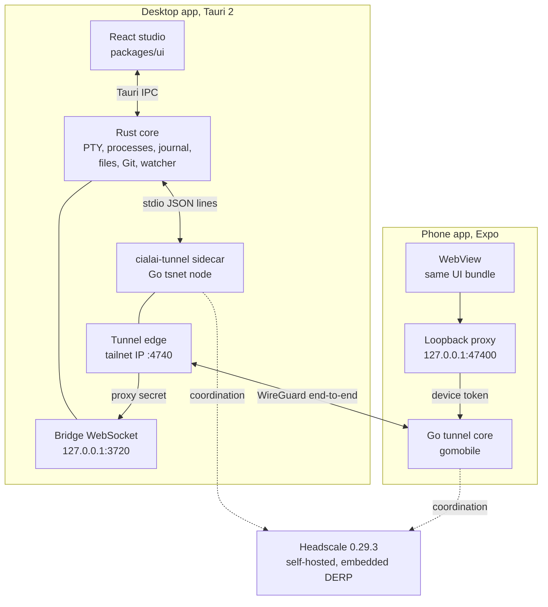
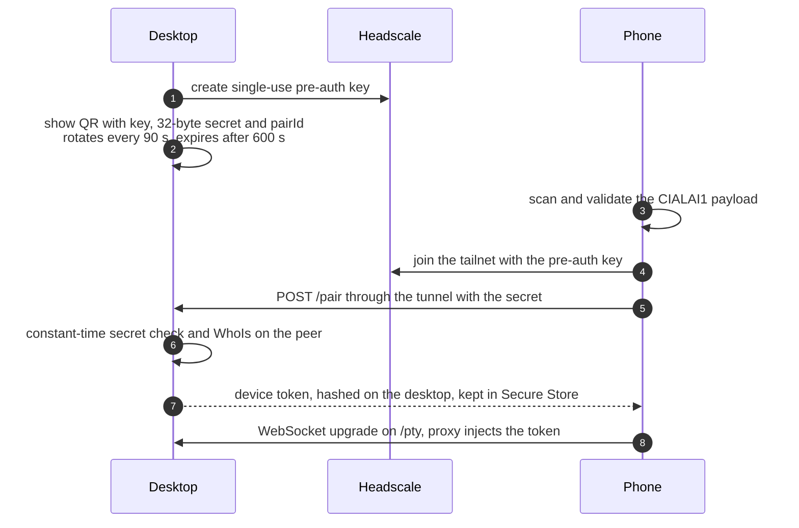

<p align="center">
  
</p>

<h3 align="center">An open source terminal studio for your computer and your phone</h3>

<p align="center">
  Every session is a shell in a folder, shown as a card that reports only what was observed.<br>
  A paired phone follows and controls those sessions over an end-to-end encrypted tunnel<br>
  coordinated by a Headscale server that you host.
</p>

<p align="center">
  
  
  
  
</p>

<p align="center">
  <a href="https://cialai.com.br">Website</a> ·
  <a href="#architecture">Architecture</a> ·
  <a href="#pairing-and-network">Pairing</a> ·
  <a href="#build-from-source">Build</a> ·
  <a href="#self-host-headscale">Self-host Headscale</a> ·
  <a href="../docs/README.md">Docs</a> ·
  <a href="../SECURITY.md">Security</a>
</p>

<picture>
  <source media="(prefers-color-scheme: dark)" srcset="assets/desktop-dark.webp">
  
</picture>

> [!WARNING]
> Cialai is experimental and has no supported production release yet. Installers and store apps are not published. See [Status](#status) for what is verified today and what is only prepared.

## Why Cialai

Cialai is built for people who keep several projects and several coding agents running at the same time. It started as the terminal studio inside Ordinum Control, an internal Ordinum tool, and is being extracted into a standalone product with the same behavior.

| Principle | What it means in practice |
| --- | --- |
| Observed, never inferred | Card state comes from the foreground process group, bytes received, exit codes and signals the program emits. The studio never claims an agent is thinking |
| The computer leads, the phone follows | A phone on a bad radio link is detached from the stream. It never blocks a shell on the computer |
| Nothing listens beyond loopback | The only exception is the tunnel edge, which exists only inside your private tailnet |
| One interface | The phone loads the same UI bundle the desktop ships. There is no second UI to maintain |
| What was recorded comes back | Raw history, terminal size, agent conversation, name, color, order and tabs survive closing or crashing the app |

## What it does

**On the computer**

* Sessions as cards with foreground command, running time, attention markers for bell, long job finished and shell exit, and CPU and memory summed across the whole process tree.
* Switching cards never interrupts anything. Process, scrollback, typed input and open tabs stay where they were.
* Claude Code and Codex are recognized from the command line, with plan usage, model and profile on the card, and conversations resume after the app restarts.
* Editor, project tree with Git markers, document previews and a Dev Browser per session, a Chromium instance the session's agents can drive through CDP.

**On the phone**

* The same cards and the same studio UI, served by your computer.
* Live output, typing and closing sessions, with a key row for Esc, Tab, Shift Tab, Ctrl C, arrows, Enter, Ctrl D, Ctrl L and Paste.
* Read-only project files, capped at 200 entries per folder and 128 KiB of UTF-8 text per preview, with hidden files, credential names, keys and symlinks blocked.
* Biometric checks when the app opens, after five minutes in background and before sensitive actions such as spawning or killing a shell.

<table>
  <tr>
    <td align="center" width="33%"><br><sub>Sessions</sub></td>
    <td align="center" width="33%"><br><sub>Terminal and key row</sub></td>
    <td align="center" width="33%"><br><sub>Read-only files</sub></td>
  </tr>
</table>

<sub>Screenshots come from the UI demo fixture. Outside the native shell xterm does not paint, so terminal panes appear empty in these captures.</sub>

## Architecture



### Components

| Path | Stack | Responsibility |
| --- | --- | --- |
| `apps/desktop` | Tauri 2.11, Rust, `portable-pty`, `tokio-tungstenite`, `sysinfo`, `notify`, `keyring` | Window, PTY, process metrics, journal and resume, files, Git, previews, Dev Browser, bridge, sidecar supervisor |
| `packages/ui` | React 18, xterm.js 6, CodeMirror 6 | Studio, desktop shell and phone shell sharing one codebase |
| `packages/protocol` | JavaScript, JSON Schema, fixtures | Bridge and pairing contract shared by the Go, Rust and JavaScript tests |
| `packages/tunnel-core` | Go 1.26.5, `tailscale.com/tsnet` 1.102.0 | tsnet node, tunnel edge, phone proxy, pairing, Headscale client, desktop sidecar and gomobile bindings |
| `packages/i18n` | JavaScript | Shared translation keys |
| `apps/mobile` | Expo 57, React Native 0.86, Swift and Kotlin native module | WebView shell, QR scanner, Headscale profiles, biometrics, loopback proxy through the Go core |
| `infra/headscale` | Docker Compose, Headscale 0.29.3 | Self-hosting recipe with embedded DERP, Let's Encrypt and access policy |
| `tools` | Node, Swift, Playwright | Checks, captures, self test, tunnel builds and release helpers |

### Processes and ports

| Process | Listens on | Accepts |
| --- | --- | --- |
| Rust bridge | `127.0.0.1:3720`, configurable with `CIALAI_BRIDGE_PORT`; when the default port is taken it opens on a free loopback port and hands that port to the sidecar | Only the tunnel edge presenting `X-Cialai-Proxy-Secret`; anything else gets 403 |
| Tunnel edge | `:4740` on the tailnet IP, never on loopback | Phones of the same Headscale user; serves the phone page, `/api/health`, `/pair` and the `/pty` upgrade |
| Phone proxy | `127.0.0.1:47400`, fallback `47401` to `47409` | Only the app's own WebView, proven by a nonce cookie; injects the device Bearer token |
| Dev Browser | `127.0.0.1` on a random port per session | The desktop WebView over CDP; refused from the phone |
| Headscale | `443/tcp`, `80/tcp` for HTTP-01, `3478/udp` for STUN | Desktop and phone nodes |

### Terminal output path

The PTY reader hands batches of up to 64 KiB, coalesced over 4 ms, to a pump that fans them out to every subscriber of the session: the desktop WebView through a Tauri `Channel`, and each remote connection through the bridge. Each session keeps its last 256 KiB in a ring buffer with an absolute byte counter, and the same bytes are appended to the session journal on disk.

Backpressure is explicit. The desktop WebView acknowledges consumed bytes with `pty_ack`; above 512 KiB pending the pump stops and the shell blocks, like a terminal nobody reads. A remote subscriber that stays above its high water mark for 3 s receives `detached` with reason `lagged` and is dropped, while the desktop keeps going. The phone reattaches with `pty_attach` and gets a replay from its last offset.

## Pairing and network



| Topic | Design |
| --- | --- |
| Transport | WireGuard end-to-end, direct or through the DERP relay embedded in your Headscale. Headscale and DERP never see terminal traffic |
| Access policy | One Headscale user per person and a `grants` policy from `autogroup:member` to `autogroup:self` on `tcp:4740` only, so people are isolated from each other |
| Rate limits | 5 pairing attempts per minute per IP; a `pairId` is locked after 10 failures |
| Tokens | One token per phone per desktop, rotated every 30 days with 24 h of overlap |
| Revocation | The Devices screen revokes a phone; the edge closes its sockets with code 4401 in under a second, and the node can also be expired and deleted in Headscale |
| Restart | The sidecar restarts with the same tsnet state, so the node identity and phone tokens stay valid |

### Bridge protocol

| Aspect | Contract |
| --- | --- |
| Transport | WebSocket; JSON text frames `hello`, `welcome`, `call`, `result`, `event`, `channel`; binary frames carry PTY output as a big endian `u32` channel id followed by bytes |
| Handshake | Loopback `Origin`, per-launch 256-bit proxy secret, device id and node key headers, and `hello` within 5 s |
| Close codes | `4400` invalid hello, `4401` invalid or revoked credential, `4426` incompatible version |
| Limits | 1 MiB frames, 8 connections, 16 concurrent calls, 64 queued outbound frames, ping every 20 s |
| Remote commands | `pty_list`, `pty_metrics`, `ai_usage`, `pty_attach`, `pty_ack`, `pty_write`, `pty_spawn`, `pty_kill`, `pty_view_claim`, `pty_view_renew`, `pty_view_release`, `pty_files_list`, `pty_file_read`, `list_repo_dirs` |
| Refused remotely | `fs_*`, `git_*`, `browser_*` |
| Versioning | `version: 1` plus a `features` array such as `terminal-mobile-v1`, which grants the phone PTY width for 15 s, renewed every 5 s |

Full specifications: [bridge protocol](../docs/07-protocolo-da-ponte.md) and [network, Headscale and pairing](../docs/06-rede-headscale-e-pareamento.md).

## Security model

* The page never sees a credential. The phone proxy and the tunnel edge authenticate on both sides, and the bridge only accepts the edge.
* Secrets never travel through argv or environment variables, and logs mask Headscale keys, device tokens and QR payloads.
* The Headscale API key lives in the operating system keychain on the desktop, never in a file.
* Out of scope: whoever holds the Headscale API key controls that server; terminal output is visible on paired phones; a sleeping computer is unreachable.

Please report vulnerabilities privately as described in [SECURITY.md](../SECURITY.md) and never test against devices or Headscale servers you do not own.

## Status

Snapshot of 13 September 2026. The live record with commands and results is [docs/13-progresso-e-handoff.md](../docs/13-progresso-e-handoff.md).

| Area | Verified | Pending |
| --- | --- | --- |
| Desktop on macOS | Rust core with 151 tests passing and 2 ignored on arm64; Tauri self test with 8 scenarios | Human parity review against the prototype |
| Desktop on Linux | Rust core with 145 tests passing on Ubuntu 22.04 arm64 inside a container | Visible WebKitGTK run, installers, Dev Browser and Office conversion |
| Desktop on Windows | Rust target checked with `cargo-xwin` | Native run, ConPTY, WebView2, IME, installers and Authenticode |
| Tunnel and pairing | End-to-end flow against Headscale 0.29.3 in Docker; revocation under 2 s; 30 minute proxy soak with zero disconnects | 24 hour soak and a real Let's Encrypt certificate |
| iOS and Android | Expo shell and native module prepared; 101 Jest tests in 15 suites | Xcode and Gradle builds, device spikes and store review |
| CI and releases | Workflows for the desktop matrix, tagged releases and Headscale integration are defined | First remote runs, code signing and notarization; releases are unsigned drafts for now |

## Build from source

### Requirements

| Tool | Version |
| --- | --- |
| Node | 22, with npm 10 |
| Rust | 1.98.1, pinned in `rust-toolchain.toml` with clippy and rustfmt |
| Go | 1.26.5; with `GOTOOLCHAIN=auto` Go fetches it for you |
| Docker | Only for the Headscale integration tests |

| System | Prerequisites |
| --- | --- |
| macOS | macOS 13 or newer and the Xcode command line tools |
| Linux | Ubuntu 22.04 is the reference, with WebKitGTK 4.1 and the Tauri system packages below |
| Windows | Windows 10 21H2 or newer, WebView2 Runtime and Visual Studio Build Tools with Desktop development with C++; PowerShell 7 preferred |

On Ubuntu:

```sh
sudo apt-get update
sudo apt-get install -y --no-install-recommends libwebkit2gtk-4.1-dev libgtk-3-dev \
  libayatana-appindicator3-dev librsvg2-dev patchelf libxdo-dev libssl-dev zsh
```

### Run

```sh
npm ci
npm run sidecar --workspace @cialai/desktop
npm test
CARGO_BUILD_JOBS=2 npm run dev:desktop
```

On Windows PowerShell:

```powershell
npm ci
npm run sidecar --workspace @cialai/desktop
$env:CARGO_BUILD_JOBS = "2"
npm run dev:desktop
```

Rebuild the sidecar before calling Cargo directly or starting the app. Rust builds in this repository are capped at two jobs. Planned desktop packages are `dmg` and `app` on macOS, `deb`, `rpm` and `AppImage` on Linux, and `nsis` and `msi` on Windows. Platform specific behavior is documented in [docs/14-diferencas-por-plataforma.md](../docs/14-diferencas-por-plataforma.md).

### Tests and checks

| Command | Runs |
| --- | --- |
| `npm test` | Every suite below plus workspace, CI matrix and platform docs guards |
| `npm run test:desktop` | UI build, `cargo fmt`, `clippy` with warnings as errors and `cargo test` |
| `npm run test:tunnel` | Headscale recipe check, `go vet` and `go test` |
| `npm run test:ui`, `test:protocol`, `test:i18n`, `test:mobile` | Package suites, with Jest on mobile |
| `npm run test:selftest` | 8 scenarios inside the macOS app binary |
| `npm run test:integration:headscale` | Pairing and revocation end-to-end against Headscale 0.29.3 in Docker |
| `npm run build:tunnel` | Sidecars for 5 target triples with `SHA256SUMS` |

## Self-host Headscale

The phone needs a Headscale server you control. The recipe in [`infra/headscale`](../infra/headscale/README.md) brings one up in about ten minutes on a Linux host with a public IP, Docker Compose v2, an A record and ports `443/tcp`, `80/tcp` and `3478/udp` open.

```sh
./bootstrap.sh --domain hs.example.com --ipv4 203.0.113.10
docker compose exec headscale headscale apikeys create --expiration 365d
```

Then open the Network section of the desktop preferences, enter `https://hs.example.com` and paste the key. The assistant checks the server, creates or picks your user and connects the computer. Terminal traffic never passes through Headscale; it only introduces devices and relays already encrypted packets when no direct path exists.

## Repository layout

```text
apps/desktop          Tauri 2 and Rust
apps/mobile           Expo for iOS and Android, native tunnel module
packages/ui           React studio, desktop and phone shells
packages/protocol     Bridge and pairing contract
packages/tunnel-core  Go tsnet node, edge, proxy, pairing and Headscale client
packages/i18n         Shared translations
infra/headscale       Docker Compose, configuration and policy
tools                 Checks, captures, self test and release helpers
docs                  Planning and living documentation
brand                 Cialai identity
```

## Documentation

Design documents are written in Portuguese. Code identifiers and comments are in English.

| Document | Covers |
| --- | --- |
| [01 Vision and scope](../docs/01-visao-e-escopo.md) | Product, audience, what is in and out |
| [03 Architecture](../docs/03-arquitetura.md) | Target design, components, ports, flows and rejected alternatives |
| [04 Desktop](../docs/04-desktop.md) | Rust core, per OS matrix, window, shortcuts and onboarding |
| [05 Mobile](../docs/05-mobile.md) | Expo shell, native tunnel module, QR scanner and stores |
| [06 Network and pairing](../docs/06-rede-headscale-e-pareamento.md) | Headscale, tunnel core, edge, proxy, threats and spikes |
| [07 Bridge protocol](../docs/07-protocolo-da-ponte.md) | WebSocket contract between the phone page and the desktop |
| [09 Monorepo and tooling](../docs/09-monorepo-e-ferramentas.md) | Layout, toolchains, scripts and conventions |
| [10 CI/CD and distribution](../docs/10-ci-cd-e-distribuicao.md) | GitHub Actions, Codemagic, signing and releases |
| [11 Roadmap](../docs/11-roadmap-de-execucao.md) | Phases, tasks and acceptance criteria |
| [12 Decisions](../docs/12-decisoes.md) | Decision log with context and consequences |

The full reading order is in [docs/README.md](../docs/README.md).

## Contributing

Issues, discussions and pull requests are welcome. Read [CONTRIBUTING.md](../CONTRIBUTING.md) and the [code of conduct](../CODE_OF_CONDUCT.md) first.

* Keep branches short and prefix commits with the area, such as `feat(desktop):` or `docs:`.
* Describe the observed problem, the resulting behavior and how you validated it.
* New files carry `SPDX-License-Identifier: Apache-2.0`.
* Never commit credentials, QR payloads, private data or generated mobile projects.

## License

Cialai is licensed under the [Apache License 2.0](../LICENSE); third party notices are in [NOTICE](../NOTICE). The Cialai name, the orchid mantis symbol and the visual identity are trademarks of Ordinum and are not covered by the license, so modified distributions should use their own name and identity.

<p align="center">
  <sub>Maintained by <a href="https://www.ordinum.com.br">Ordinum</a> in Uberlândia, Brazil</sub>
</p>
