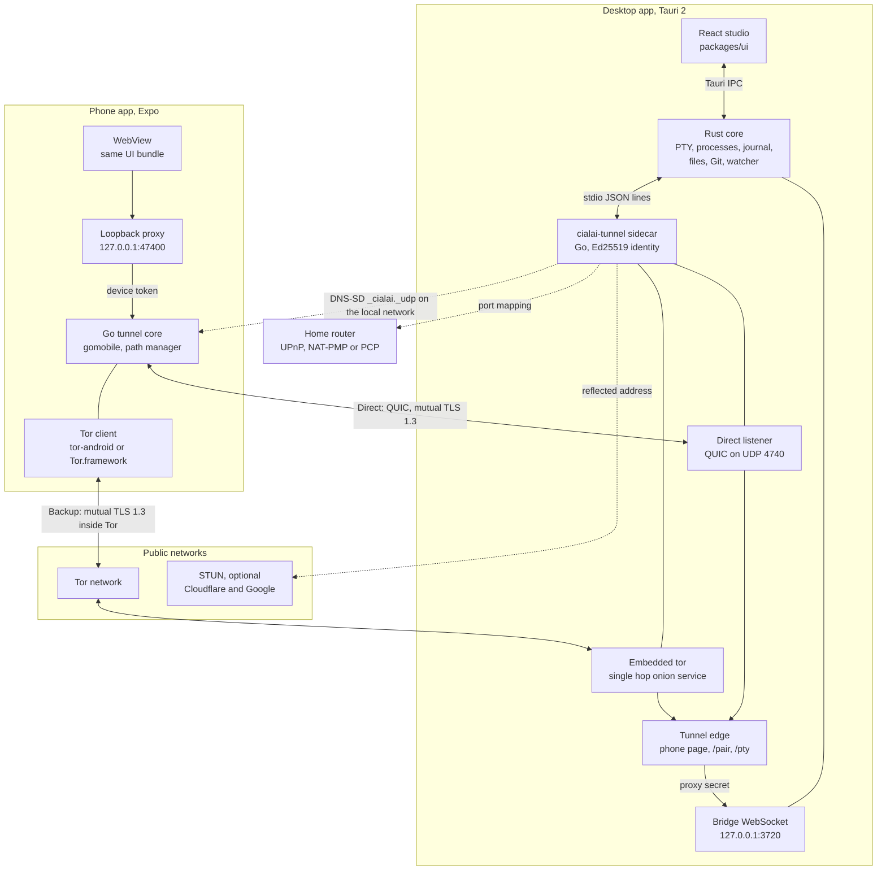
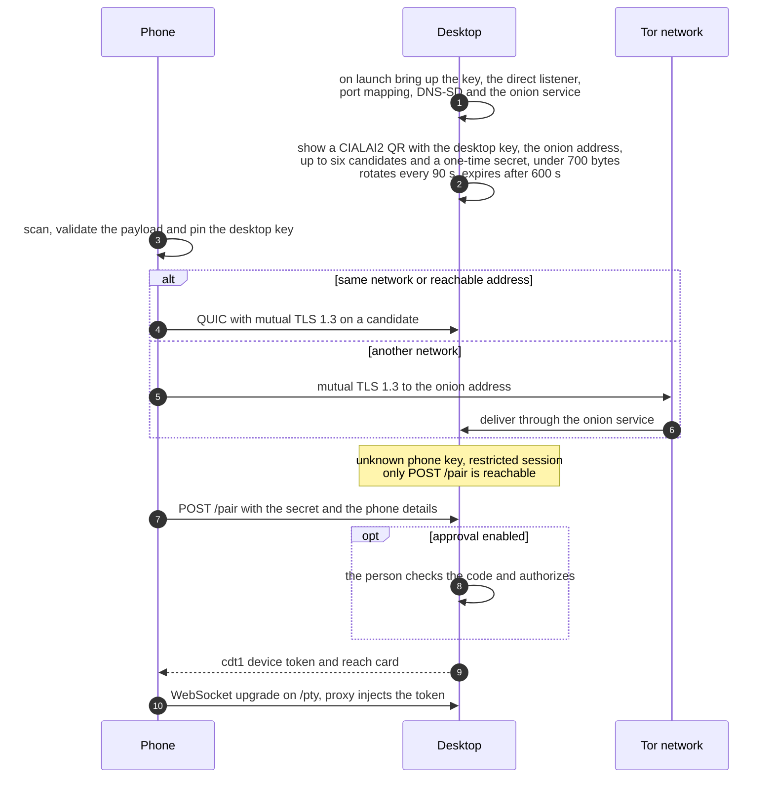
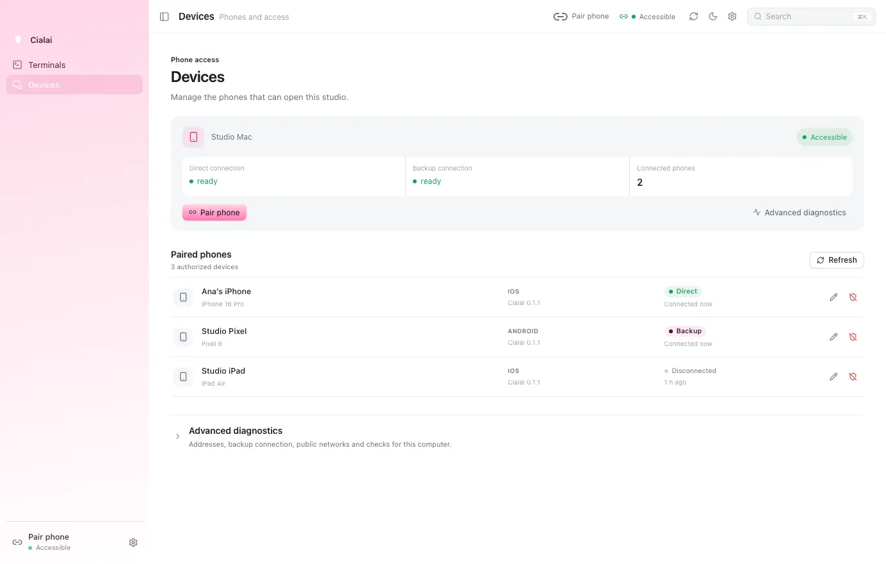

<p align="center">
  
</p>

<h3 align="center">An open source terminal studio for your computer and your phone</h3>

<p align="center">
  Every session is a shell in a folder, shown as a card that reports only what was observed.<br>
  A paired phone follows and controls those sessions over an end-to-end encrypted connection<br>
  that comes up on its own, with no server to host.
</p>

<p align="center">
  
  
  
  
</p>

<p align="center">
  <a href="https://cialai.com.br">Website</a> ·
  <a href="#architecture">Architecture</a> ·
  <a href="#pairing-and-network">Pairing</a> ·
  <a href="#build-from-source">Build</a> ·
  <a href="#public-networks-and-limits">Networks and limits</a> ·
  <a href="../docs/README.md">Docs</a> ·
  <a href="../SECURITY.md">Security</a>
</p>

<picture>
  <source media="(prefers-color-scheme: dark)" srcset="assets/desktop-dark.webp">
  
</picture>

> [!WARNING]
> Cialai is experimental and has no supported production release yet. Preview installers are published on GitHub Releases; store apps are not. See [Status](#status) for what is verified today and what is only prepared.

## Why Cialai

Cialai is built for people who keep several projects and several coding agents running at the same time. It started as the terminal studio inside Ordinum Control, an internal Ordinum tool, and is being extracted into a standalone product with the same behavior.

| Principle | What it means in practice |
| --- | --- |
| Observed, never inferred | Card state comes from the foreground process group, bytes received, exit codes and signals the program emits. The studio never claims an agent is thinking |
| The computer leads, the phone follows | A phone on a bad radio link is detached from the stream. It never blocks a shell on the computer |
| Only paired keys get in | Beyond loopback, the computer accepts only mutual TLS 1.3 sessions. A key that is not paired reaches nothing but the pairing request |
| One interface | The phone loads the same UI bundle the desktop ships. There is no second UI to maintain |
| What was recorded comes back | Raw history, terminal size, agent conversation, name, color, order and tabs survive closing or crashing the app |

## What it does

**On the computer**

* Sessions as cards with foreground command, running time, attention markers for bell, long job finished and shell exit, and CPU and memory summed across the whole process tree.
* Switching cards never interrupts anything. Process, scrollback, typed input and open tabs stay where they were.
* Claude Code and Codex are recognized from the command line, with plan usage, model and profile on the card, and conversations resume after the app restarts.
* Editor, project tree with Git markers, document previews and a Dev Browser per session, a Chromium instance the session's agents can drive through CDP.

**On the phone**

* The same cards and the same studio UI, served by your computer.
* Live output, typing and closing sessions, with a key row for Esc, Tab, Shift Tab, Ctrl C, arrows, Enter, Ctrl D, Ctrl L and Paste.
* Read-only project files, capped at 200 entries per folder and 128 KiB of UTF-8 text per preview, with hidden files, credential names, keys and symlinks blocked.
* Biometric checks when the app opens, after five minutes in background and before sensitive actions such as spawning or killing a shell.
* A **Direct** or **Backup** badge that shows which path carries the connection.

<table>
  <tr>
    <td align="center" width="33%"><br><sub>Sessions</sub></td>
    <td align="center" width="33%"><br><sub>Terminal and key row</sub></td>
    <td align="center" width="33%"><br><sub>Read-only files</sub></td>
  </tr>
</table>

<sub>Screenshots come from the UI demo fixture. Outside the native shell xterm does not paint, so terminal panes appear empty in these captures.</sub>

## Architecture



No server run by you, by Ordinum or by the project takes part. The computer brings its connectivity up when the app opens. The direct path links the two devices; the backup crosses public Tor relays with the content still under mutual TLS 1.3, and the phone upgrades from the backup to a direct connection when the network allows.

### Components

| Path | Stack | Responsibility |
| --- | --- | --- |
| `apps/desktop` | Tauri 2.11, Rust, `portable-pty`, `tokio-tungstenite`, `sysinfo`, `notify`, `keyring`, Tor Expert Bundle 15.0.22 with tor 0.4.9.12 | Window, PTY, process metrics, journal and resume, files, Git, previews, Dev Browser, bridge, sidecar supervisor and the bundled `tor` resource that the sidecar starts |
| `packages/ui` | React 18, xterm.js 6, CodeMirror 6 | Studio, desktop shell and phone shell sharing one codebase |
| `packages/protocol` | JavaScript, JSON Schema, fixtures | Bridge and pairing contract shared by the Go, Rust and JavaScript tests |
| `packages/tunnel-core` | Go 1.26.5, `quic-go`, `bine`, `pion/mdns`, the Tailscale port mapper | Ed25519 identity, direct QUIC transport, Tor controller and onion listener, rendezvous and NAT punch, DNS-SD, tunnel edge, phone path manager and proxy, pairing, desktop sidecar and gomobile bindings. The former Headscale mode stays in the tree, inert, until device validation |
| `packages/i18n` | JavaScript | Shared translation keys |
| `apps/mobile` | Expo 57, React Native 0.86, Swift and Kotlin native module, tor-android on Android and Tor.framework on iOS | WebView shell, QR scanner, paired computers, connection badges, biometrics, loopback proxy through the Go core |
| `infra/headscale` | Docker Compose, Headscale 0.29.3 | Historical recipe from the 0.1.x previews, no longer part of the product path |
| `tools` | Node, Swift, Playwright | Checks, captures, self test, tunnel builds and release helpers |

### Processes and ports

| Process | Listens on | Accepts |
| --- | --- | --- |
| Rust bridge | `127.0.0.1:3720`, configurable with `CIALAI_BRIDGE_PORT`; when the default port is taken it opens on a free loopback port and hands that port to the sidecar | Only the tunnel edge presenting `X-Cialai-Proxy-Secret`; anything else gets 403 |
| Direct listener | UDP `4740` on every interface, or a free port when it is taken | QUIC sessions with mutual TLS 1.3. A key that is not paired gets a restricted session that only reaches `POST /pair` while a pairing code is active |
| Onion service | Single hop onion service of the embedded `tor`, with `SocksPort 0` on the desktop | The same mutual TLS sessions through the Tor network, plus the control channel for registered keys |
| Tunnel edge | No socket of its own; serves the streams of both transports | Paired phones; serves the phone page, `/api/health`, `/pair` and the `/pty` upgrade |
| Phone proxy | `127.0.0.1:47400`, fallback `47401` to `47409` | Only the app's own WebView, proven by a nonce cookie; injects the device Bearer token |
| Dev Browser | `127.0.0.1` on a random port per session | The desktop WebView over CDP; refused from the phone |
| DNS-SD | Multicast DNS on the local network | Announces `_cialai._udp` under a name derived from the key fingerprint, never the computer name |

### Terminal output path

The PTY reader hands batches of up to 64 KiB, coalesced over 4 ms, to a pump that fans them out to every subscriber of the session: the desktop WebView through a Tauri `Channel`, and each remote connection through the bridge. Each session keeps its last 256 KiB in a ring buffer with an absolute byte counter, and the same bytes are appended to the session journal on disk.

Backpressure is explicit. The desktop WebView acknowledges consumed bytes with `pty_ack`; above 512 KiB pending the pump stops and the shell blocks, like a terminal nobody reads. A remote subscriber that stays above its high water mark for 3 s receives `detached` with reason `lagged` and is dropped, while the desktop keeps going. The phone reattaches with `pty_attach` and gets a replay from its last offset.

## Pairing and network



<picture>
  <source media="(prefers-color-scheme: dark)" srcset="assets/devices-dark.webp">
  
</picture>

<sub>Demo mode capture with fictional devices. No real pairing payload is shown.</sub>

| Topic | Design |
| --- | --- |
| Identity | One Ed25519 key per computer and per phone. The phone pins the desktop key from the QR and every session proves both keys over mutual TLS 1.3 |
| Direct path | QUIC over UDP, with candidates from the local network, global IPv6, a port mapped by UPnP, NAT-PMP or PCP and an optional STUN reflected address |
| Backup path | The same mutual TLS inside the Tor network, through a single hop onion service on the desktop. The onion address derives from a persisted key, so it is always in the QR |
| Path choice | Local network first, then direct over the internet, then the backup through Tor. On the backup the phone tries a NAT punch coordinated over the control channel and moves to direct when it succeeds |
| Pairing entry | A key that is not paired only reaches `POST /pair`, only while a pairing code is active; approval by code is optional |
| Rate limits | 5 pairing attempts per minute; a pairing code is locked after 10 wrong secrets |
| Tokens | One `cdt1` token per phone per desktop, rotated every 30 days with 24 h of overlap |
| Revocation | The Devices screen revokes a phone; its sessions close on both transports and the bridge closes its sockets with code 4401 |
| Restart | The sidecar restarts with the same identity and onion keys, so paired phones and their tokens stay valid |
| Upgrade from 0.1.x | Pairings made with the Headscale previews do not carry over. Pair the phone again |

### Bridge protocol

| Aspect | Contract |
| --- | --- |
| Transport | WebSocket; JSON text frames `hello`, `welcome`, `call`, `result`, `event`, `channel`; binary frames carry PTY output as a big endian `u32` channel id followed by bytes |
| Handshake | Loopback `Origin`, per-launch 256-bit proxy secret, device id, device key and transport headers, and `hello` within 5 s |
| Close codes | `4400` invalid hello, `4401` invalid or revoked credential, `4426` incompatible version |
| Limits | 1 MiB frames, 8 connections, 16 concurrent calls, 64 queued outbound frames, ping every 20 s |
| Remote commands | `pty_list`, `pty_metrics`, `ai_usage`, `pty_attach`, `pty_ack`, `pty_write`, `pty_spawn`, `pty_kill`, `pty_view_claim`, `pty_view_renew`, `pty_view_release`, `pty_files_list`, `pty_file_read`, `list_repo_dirs` |
| Refused remotely | `fs_*`, `git_*`, `browser_*` |
| Versioning | `version: 1` plus a `features` array such as `terminal-mobile-v1`, which grants the phone PTY width for 15 s, renewed every 5 s |

Full specifications: [bridge protocol](../docs/07-protocolo-da-ponte.md) and [network and pairing](../docs/06-rede-headscale-e-pareamento.md).

## Security model

* The page never sees a credential. The phone proxy and the tunnel edge authenticate on both sides, and the bridge only accepts the edge.
* Every session, direct or through Tor, uses mutual TLS 1.3 with Ed25519 keys. The desktop accepts only registered keys, apart from the restricted pairing entry.
* Secrets never travel through argv or environment variables, and logs mask keys, device tokens, secrets and QR payloads.
* The onion service is single hop and does not hide where the computer is. It exists to be reachable from another network, not to provide anonymity.
* Out of scope: terminal output is visible on paired phones; Tor relays and the optional STUN servers can observe network metadata, never terminal content; a sleeping computer or a closed app is unreachable.

Please report vulnerabilities privately as described in [SECURITY.md](../SECURITY.md) and never test against devices or computers you do not own.

## Status

Snapshot of 15 September 2026. The desktop and mobile rows were last reviewed on 13 September 2026. The live record with commands and results is [docs/13-progresso-e-handoff.md](../docs/13-progresso-e-handoff.md).

| Area | Verified | Pending |
| --- | --- | --- |
| Desktop on macOS | Rust core with 151 tests passing and 2 ignored on arm64; Tauri self test with 8 scenarios | Human parity review against the prototype |
| Desktop on Linux | Rust core with 145 tests passing on Ubuntu 22.04 arm64 inside a container; GitHub Actions builds, tests and bundles on Ubuntu 22.04 | Visible WebKitGTK run, Dev Browser and Office conversion |
| Desktop on Windows | GitHub Actions runs the native Rust suite, the Go core tests, Jest and an unsigned bundle on Windows 2022 | Physical machine, ConPTY, WebView2 with a GPU, IME and Authenticode |
| Automatic connectivity | Identity, direct QUIC, port mapping, STUN, DNS-SD, onion service, pairing, NAT punch and revocation covered by automated suites and by in process tests against the real Tor network | The [connectivity checklist](../docs/testes/roteiro-conectividade.md) on real phones, computers and networks |
| iOS and Android | Expo shell, native module and Jest suites; Android preview APK published | iOS build, Tor on real phones, device checks and store review |
| CI and releases | Desktop matrix green on GitHub Actions; previews 0.1.0 and 0.1.1 published with desktop installers, the Android APK and a signed updater manifest; macOS notarization accepted locally | Windows code signing, TestFlight, store review and version 1.0.0 |

## Build from source

### Requirements

| Tool | Version |
| --- | --- |
| Node | 22, with npm 10 |
| Rust | 1.98.1, pinned in `rust-toolchain.toml` with clippy and rustfmt |
| Go | 1.26.5; with `GOTOOLCHAIN=auto` Go fetches it for you |
| Docker | Not needed for connectivity; only for the legacy Headscale integration test |

| System | Prerequisites |
| --- | --- |
| macOS | macOS 13 or newer and the Xcode command line tools |
| Linux | Ubuntu 22.04 is the reference, with WebKitGTK 4.1 and the Tauri system packages below |
| Windows | Windows 10 21H2 or newer, WebView2 Runtime and Visual Studio Build Tools with Desktop development with C++; PowerShell 7 preferred |

On Ubuntu:

```sh
sudo apt-get update
sudo apt-get install -y --no-install-recommends libwebkit2gtk-4.1-dev libgtk-3-dev \
  libayatana-appindicator3-dev librsvg2-dev patchelf libxdo-dev libssl-dev zsh
```

### Run

```sh
npm ci
npm run sidecar --workspace @cialai/desktop
npm test
CARGO_BUILD_JOBS=2 npm run dev:desktop
```

On Windows PowerShell:

```powershell
npm ci
npm run sidecar --workspace @cialai/desktop
$env:CARGO_BUILD_JOBS = "2"
npm run dev:desktop
```

Rebuild the sidecar before calling Cargo directly or starting the app. The sidecar step also stages the pinned Tor Expert Bundle after checking its SHA-256; a target without a Tor bundle builds without the backup connection. Rust builds in this repository are capped at two jobs. Planned desktop packages are `dmg` and `app` on macOS, `deb`, `rpm` and `AppImage` on Linux, and `nsis` and `msi` on Windows. Platform specific behavior is documented in [docs/14-diferencas-por-plataforma.md](../docs/14-diferencas-por-plataforma.md).

### Tests and checks

| Command | Runs |
| --- | --- |
| `npm test` | Every suite below plus workspace, CI matrix and platform docs guards |
| `npm run test:desktop` | UI build, `cargo fmt`, `clippy` with warnings as errors and `cargo test` |
| `npm run test:tunnel` | Historical Headscale recipe check, `go vet` and `go test` for the tunnel core; the tests against the public Tor network run only with `CIALAI_TOR_BIN`, as described in CONTRIBUTING |
| `npm run test:ui`, `test:protocol`, `test:i18n`, `test:mobile` | Package suites, with Jest on mobile |
| `npm run test:selftest` | 8 scenarios inside the macOS app binary |
| `npm run test:integration:headscale` | Legacy Headscale mode against Headscale 0.29.3 in Docker, kept until that mode is removed |
| `npm run build:tunnel` | Sidecars for 5 target triples with `SHA256SUMS` |

## Public networks and limits

Cialai runs no server of its own. The advanced diagnostics on the Devices screen list what the computer uses:

| Network | Why |
| --- | --- |
| Tor network | Meeting point and backup connection when the phone is on another network |
| STUN servers from Cloudflare and Google | Optional. Find the public address of the computer for the direct connection |
| DNS-SD on the local network | Lets a phone on the same network find the computer without waiting for Tor |

Limits of this preview:

* The computer must be on, awake and running Cialai.
* A network that blocks both Tor and UDP leaves the phone without a path.
* The backup through Tor is slower than a direct connection.
* Pairings from the 0.1.x previews do not migrate; pair the phone again.
* The physical checklist on real phones and networks is still pending.

## Repository layout

```text
apps/desktop          Tauri 2 and Rust
apps/mobile           Expo for iOS and Android, native tunnel module
packages/ui           React studio, desktop and phone shells
packages/protocol     Bridge and pairing contract
packages/tunnel-core  Go identity, QUIC and Tor transports, edge, proxy and pairing
packages/i18n         Shared translations
infra/headscale       Historical Headscale recipe, no longer used by the product
tools                 Checks, captures, self test and release helpers
docs                  Planning and living documentation
brand                 Cialai identity
```

## Documentation

Design documents are written in Portuguese. Code identifiers and comments are in English.

| Document | Covers |
| --- | --- |
| [01 Vision and scope](../docs/01-visao-e-escopo.md) | Product, audience, what is in and out |
| [03 Architecture](../docs/03-arquitetura.md) | Target design, components, ports, flows and rejected alternatives |
| [04 Desktop](../docs/04-desktop.md) | Rust core, per OS matrix, window, shortcuts and onboarding |
| [05 Mobile](../docs/05-mobile.md) | Expo shell, native tunnel module, QR scanner and stores |
| [06 Network and pairing](../docs/06-rede-headscale-e-pareamento.md) | Automatic connectivity, tunnel core, edge, proxy, pairing and threats; Headscale sections are historical |
| [07 Bridge protocol](../docs/07-protocolo-da-ponte.md) | WebSocket contract between the phone page and the desktop |
| [09 Monorepo and tooling](../docs/09-monorepo-e-ferramentas.md) | Layout, toolchains, scripts and conventions |
| [10 CI/CD and distribution](../docs/10-ci-cd-e-distribuicao.md) | GitHub Actions, Codemagic, signing and releases |
| [11 Roadmap](../docs/11-roadmap-de-execucao.md) | Phases, tasks and acceptance criteria |
| [12 Decisions](../docs/12-decisoes.md) | Decision log with context and consequences |

The full reading order is in [docs/README.md](../docs/README.md).

## Contributing

Issues, discussions and pull requests are welcome. Read [CONTRIBUTING.md](../CONTRIBUTING.md) and the [code of conduct](../CODE_OF_CONDUCT.md) first.

* Keep branches short and prefix commits with the area, such as `feat(desktop):` or `docs:`.
* Describe the observed problem, the resulting behavior and how you validated it.
* New files carry `SPDX-License-Identifier: Apache-2.0`.
* Never commit credentials, QR payloads, private data or generated mobile projects.

## License

Cialai is licensed under the [Apache License 2.0](../LICENSE); third party notices are in [NOTICE](../NOTICE). The Cialai name, the orchid mantis symbol and the visual identity are trademarks of Ordinum and are not covered by the license, so modified distributions should use their own name and identity.

<p align="center">
  <sub>Maintained by <a href="https://www.ordinum.com.br">Ordinum</a> in Uberlândia, Brazil</sub>
</p>
