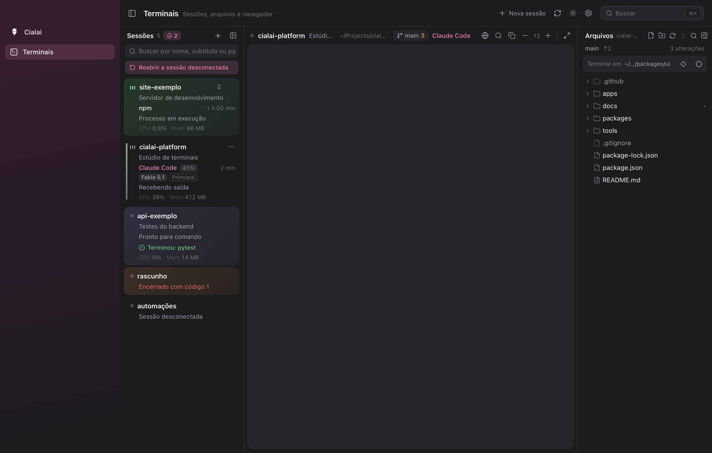
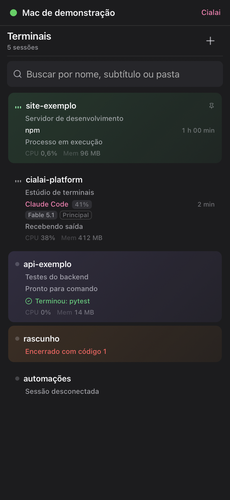
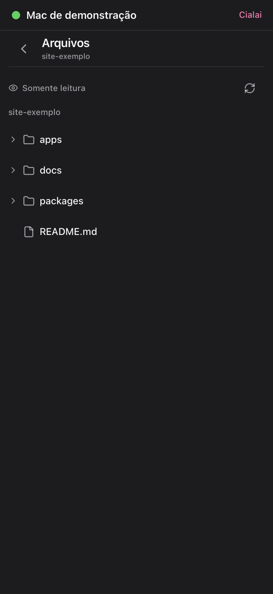

# Cialai

Cialai is an open source terminal studio for desktop and mobile. It keeps shells, files, Git context, previews and coding agent sessions together, then lets you reach the same terminal history from a paired phone. The computer and the phone connect on their own, directly whenever the network allows, with no server run by you, by Ordinum or by the project.

> Cialai is in preview. Preview installers for macOS, Windows, Linux and Android are published on [cialai.com.br](https://cialai.com.br/#baixar), with checksums in `SHA256SUMS.txt` on the same mirror. Version 1.0.0 and the store listings have not been published yet, and the iOS app is not in the App Store.

## A terminal workspace that travels with you



The desktop studio runs the real shell inside your project folder. Session cards show activity, resource use and agent state. The workspace combines the terminal with project files, previews and a controlled Chromium browser.

| Phone sessions | Phone files |
| --- | --- |
|  |  |

These captures use fictional projects and the reproducible demo mode. The complete visual evidence set is in [docs/evidence/task-1.11](./docs/evidence/task-1.11/README.md).

## Highlights

- Run and organize terminal sessions from macOS, Linux and Windows.
- Keep terminal history available after the desktop app closes.
- Resume supported Claude Code and Codex sessions in the same project folder.
- Browse and edit project files, inspect Git changes and open local previews.
- Use the built in Dev Browser for web development workflows.
- Pair iOS and Android devices with a short lived QR code.
- Reach the computer from the phone automatically, over a direct encrypted connection when possible and through an embedded Tor onion service as backup.
- Keep project contents and credentials out of Cialai hosted services because there are none.

## Install a preview

Downloads live on [cialai.com.br](https://cialai.com.br/#baixar). On macOS and Linux, one command downloads the current build for your system, checks it against `SHA256SUMS.txt` and installs it:

```sh
curl -fsSL https://cialai.com.br/install.sh | bash
```

Windows installers and the Android APK are on the same page. The desktop app checks the same mirror for signed updates. Each preview is described in the [changelog](./CHANGELOG.md).

## Project status

| Area | Status |
| --- | --- |
| Desktop studio | Implemented and verified locally on macOS |
| Automatic connectivity | Implemented with automated suites and in process tests against the real Tor network; the physical checklist on real devices is pending |
| iOS and Android | Android preview APK published; iOS builds run through TestFlight; store review and real device checks pending |
| Linux and Windows | GitHub Actions builds, tests and bundles on Ubuntu 22.04 and Windows 2022; physical Windows machines and code signing pending |
| Signed releases and stores | macOS previews signed with Developer ID and notarized; Windows signing, store review and version 1.0.0 pending |

Prepared code is not the same as verified distribution. See the [roadmap](./docs/produto/11-roadmap-de-execucao.md) for the state of each task and the remaining external work.

## Run the desktop app from source

You need Node 22, npm 10, Go 1.26.5, the Rust toolchain declared by the repository and the native prerequisites for Tauri 2 on your system.

```sh
npm ci
npm run dev:desktop
```

The development command builds the local `cialai-tunnel` sidecar before starting Tauri and stages the pinned Tor Expert Bundle after checking its SHA-256. When no Tor bundle exists for your target, the local build runs without the backup connection. No credentials or project data are bundled with the repository.

Run the automated suites with:

```sh
npm test
```

Detailed setup, test and contribution guidance is in [CONTRIBUTING.md](./CONTRIBUTING.md).

## Platform setup

All platforms use Git, Node 22, npm 10, Rust 1.98.1 and Go 1.26.5. Build the local `cialai-tunnel` sidecar before calling Cargo directly; `npm run dev:desktop` already does it. Rust builds in this repository are limited to two jobs.

```sh
npm ci
npm run sidecar --workspace @cialai/desktop
npm test
```

### macOS

Requires macOS 13 or newer and the Xcode command line tools. Local bundles use `app` and `dmg`. Developer ID signing and notarization are not part of the local flow.

```sh
xcode-select --install
CARGO_BUILD_JOBS=2 npm run dev:desktop
```

### Linux

The reference build is Ubuntu 22.04 with WebKitGTK 4.1. Install the Tauri dependencies first. Planned packages are `deb`, `rpm` and `AppImage`.

```sh
sudo apt-get update
sudo apt-get install -y --no-install-recommends libwebkit2gtk-4.1-dev libgtk-3-dev libayatana-appindicator3-dev librsvg2-dev patchelf libxdo-dev libssl-dev zsh
CARGO_BUILD_JOBS=2 npm run dev:desktop
```

### Windows

Requires Windows 10 21H2 or newer, the WebView2 Runtime and Visual Studio Build Tools with Desktop development with C++. PowerShell 7 is preferred; Windows PowerShell and `cmd.exe` remain supported fallbacks. Planned packages are `nsis` and `msi`.

```powershell
npm ci
$env:CARGO_BUILD_JOBS = "2"
npm run dev:desktop
```

Windows runs the native Rust suite, the Go core tests, Jest and an unsigned bundle on GitHub Actions. A physical Windows machine, WebView2 with a GPU, installing the packages and code signing have not been exercised. Behavior differences between systems are documented in [docs/arquitetura/14-diferencas-por-plataforma.md](./docs/arquitetura/14-diferencas-por-plataforma.md).

## Connect your phone

There is nothing to set up. When the desktop app opens, the computer brings its connectivity up by itself:

- An Ed25519 key identifies the computer and each phone.
- A direct QUIC listener on UDP port 4740, or a free port when that one is taken, accepts only mutual TLS 1.3 sessions.
- The router maps the port through UPnP, NAT-PMP or PCP when it allows.
- Optional STUN requests to public Cloudflare and Google servers find the public address.
- A DNS-SD `_cialai._udp` announcement makes the computer visible on the local network.
- An embedded single hop Tor onion service works as meeting point and backup.

Choose **Pair phone**, scan the QR code in the mobile app and confirm the approval code when approval is enabled. The phone tries the local network first, then the direct path over the internet, then the backup through Tor. While on the backup, it keeps trying to upgrade to a direct path with a NAT punch coordinated over the control channel. The phone and the Devices screen show a **Direct** or **Backup** badge for each connection.

Limits: the computer must be on with Cialai open; networks that block both Tor and UDP leave no path; the backup is slower than a direct connection. Pairings from 0.1.x previews do not carry over, so pair again after updating. Real device validation remains required before the first mobile release.

## Repository map

```text
apps/desktop          Tauri desktop application
apps/mobile           Expo application and native tunnel modules
packages/ui           Shared React terminal studio
packages/protocol     Desktop and phone bridge protocol
packages/tunnel-core  Go networking core and desktop sidecar
infra/headscale       Historical Headscale recipe, no longer used by the product
tools                 Checks, builds, browser tests and release helpers
docs                  Architecture, decisions, evidence and handoff
```

Start with the [documentation index](./docs/README.md) for the architecture and decisions.

## Privacy and security

Cialai does not provide an account, analytics service or hosted relay. Project contents stay on devices you control and terminal traffic uses mutual TLS 1.3 between paired devices, on the direct path and through Tor. The only public networks involved are the Tor network, optional STUN servers and DNS-SD on your local network. Read [SECURITY.md](./SECURITY.md) before reporting a vulnerability. Legal documents for the first release live in `docs/legal`.

## License

Licensed under Apache License 2.0. See [LICENSE](./LICENSE) and [NOTICE](./NOTICE).
